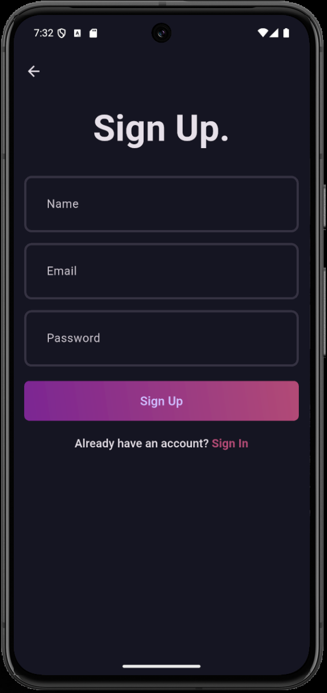
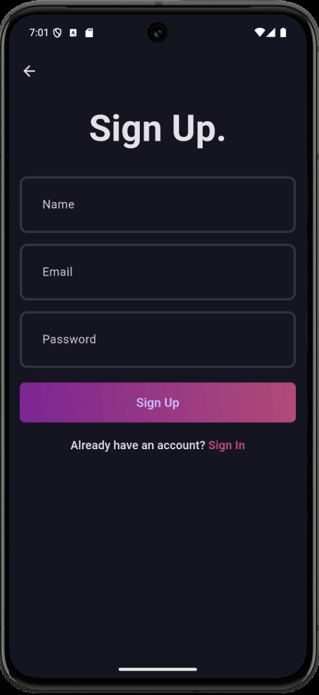
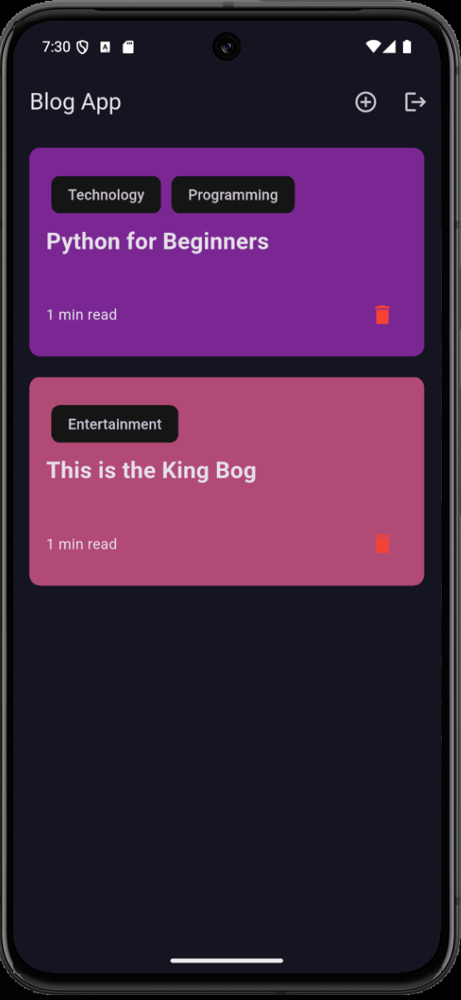
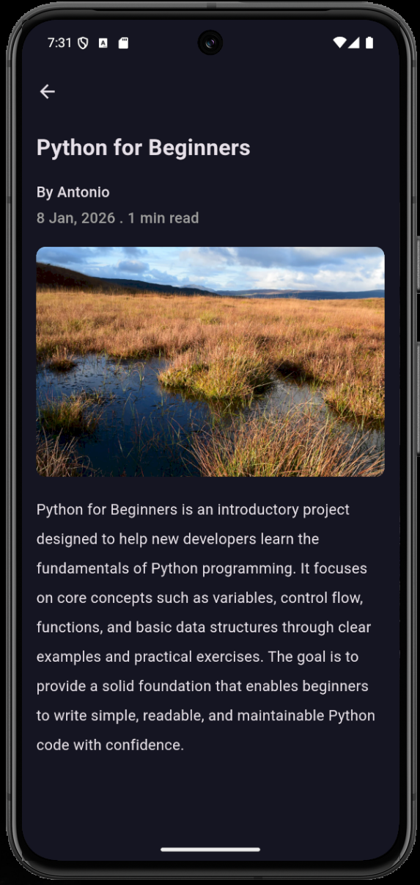
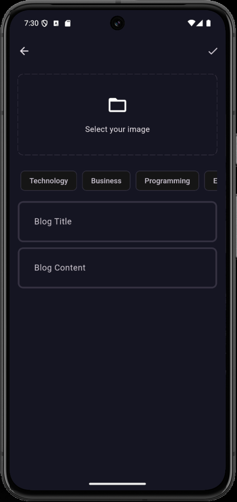
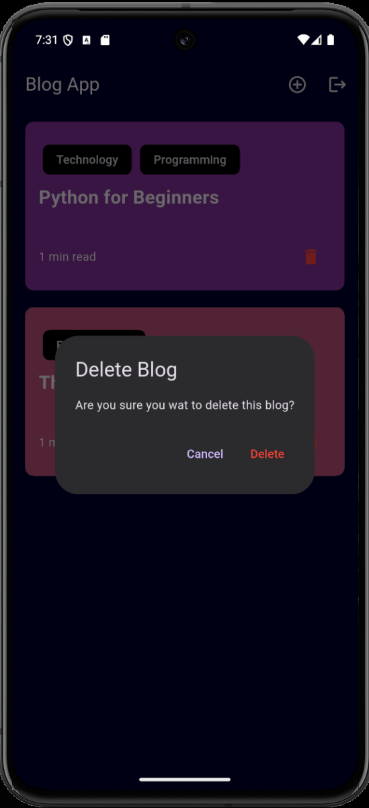

# 📱 Blog App - Flutter Clean Architecture


A complete and robust Blogging application built with **Flutter**, implementing **Clean Architecture** to ensure scalability, testability, and clear separation of concerns.
The backend is powered by **Supabase** (PostgreSQL + Auth + Storage).

## 📸 Screenshots

<p align="center"> 
    
   &nbsp;&nbsp;&nbsp;&nbsp;&nbsp;&nbsp;&nbsp;&nbsp;&nbsp;&nbsp;  
   
   &nbsp;&nbsp;&nbsp;&nbsp;&nbsp;&nbsp;&nbsp;&nbsp;&nbsp;&nbsp;  
   <br>
   &nbsp;&nbsp;&nbsp;&nbsp;&nbsp;&nbsp;&nbsp;&nbsp;&nbsp;&nbsp;  
   
   &nbsp;&nbsp;&nbsp;&nbsp;&nbsp;&nbsp;&nbsp;&nbsp;&nbsp;&nbsp;  
    
   &nbsp;&nbsp;&nbsp;&nbsp;&nbsp;&nbsp;&nbsp;&nbsp;&nbsp;&nbsp;  
   
<p>

## ✨ Key Features

* **AFull Authentication:** Sign up, login, and session persistence (the user remains logged in after closing the app).

* **Blog Management (CRUD):**
    * **Create:** Image upload to the cloud and a rich text editor with category selection.
    * **Read:** Infinite list of blog posts with automatic reading time calculation.
    * **Delete:** Secure deletion (only the post author can see and use the delete button).
* **File Uploads:** Integration with Supabase Storage for hosting cover images.
* **UI/UX:** Modern design with Dark Mode, form validations, and visual feedback (loaders, snackbars).

## 🛠️ Tech Stack

This application stands out for using enterprise-level technologies and design patterns:

* **Framework:** Flutter & Dart.
* **State Management:** **BLoC (Business Logic Component)**. xtensive use of Events and States to fully decouple business logic from the UI.
* **Architecture:** **Clean Architecture**. The codebase is strictly divided into layers:
    * *Domain:* Entities and Use Cases (pure business rules).
    * *Data:* Models, Data Sources (Supabase), and Repositories.
    * *Presentation:* BLoC, Pages, and Widgets.
* **Backend as a Service:** **Supabase**.
    * PostgreSQL database.
    * Authentication (Auth).
    * File storage (Storage Buckets).
* **IDependency Injection:** `get_it` for managing class and service instantiation.
* **Functional Programming:** `fpdart` for robust error handling using `Either<Failure, Success>`types.

## 📂 Project Structure

The project follows a feature-based modular structure:

```text
lib/
├── core/               # Shared utilities (Theme, UseCases, Errors)
├── features/
│   ├── auth/           # Authentication module
│   │   ├── data/
│   │   ├── domain/
│   │   └── presentation/
│   └── blog/           # Blog module
│       ├── data/
│       ├── domain/
│       └── presentation/
├── init_dependencies.dart # Dependency injection (Service Locator)
└── main.dart

```

## 📄 License

This project is licensed under the MIT License. See the LICENSE file for full details.
---
Made with 💙 and Flutter.
